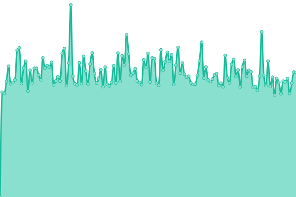
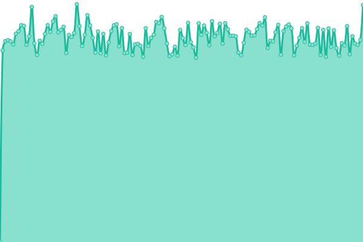

# [📈 Live Status](https://SRESchool.github.io/All-Motoshare-Websites-Uptime-Monitor): <!--live status--> **🟩 All systems operational**

This repository contains the open-source uptime monitor and status page for [SRESchool](https://SRESchool.github.io/All-Motoshare-Websites-Uptime-Monitor), powered by [Upptime](https://github.com/upptime/upptime).

With [Upptime](https://upptime.js.org), you can get your own unlimited and free uptime monitor and status page, powered entirely by a GitHub repository. We use [Issues](https://github.com/SRESchool/All-Motoshare-Websites-Uptime-Monitor/issues) as incident reports, [Actions](https://github.com/SRESchool/All-Motoshare-Websites-Uptime-Monitor/actions) as uptime monitors, and [Pages](https://SRESchool.github.io/All-Motoshare-Websites-Uptime-Monitor) for the status page.

<!--start: status pages-->
<!-- This summary is generated by Upptime (https://github.com/upptime/upptime) -->
<!-- Do not edit this manually, your changes will be overwritten -->
<!-- prettier-ignore -->
| URL | Status | History | Response Time | Uptime |
| --- | ------ | ------- | ------------- | ------ |
|  [MotoShare Asia](https://motoshare.asia) | 🟩 Up | [moto-share-asia.yml](https://github.com/SRESchool/All-Motoshare-Websites-Uptime-Monitor/commits/HEAD/history/moto-share-asia.yml) | 

 1775ms
     
 | 

<a href="https://SRESchool.github.io/All-Motoshare-Websites-Uptime-Monitor/history/moto-share-asia">72.75%</a>
    

|  [MotoShare Canada](https://motoshare.ca) | 🟩 Up | [moto-share-canada.yml](https://github.com/SRESchool/All-Motoshare-Websites-Uptime-Monitor/commits/HEAD/history/moto-share-canada.yml) | 

 1371ms
     
 | 

<a href="https://SRESchool.github.io/All-Motoshare-Websites-Uptime-Monitor/history/moto-share-canada">100.00%</a>
    

|  [MotoShare Colombia](https://motoshare.co) | 🟩 Up | [moto-share-colombia.yml](https://github.com/SRESchool/All-Motoshare-Websites-Uptime-Monitor/commits/HEAD/history/moto-share-colombia.yml) | 

 1380ms
     
 | 

<a href="https://SRESchool.github.io/All-Motoshare-Websites-Uptime-Monitor/history/moto-share-colombia">100.00%</a>
    

|  [MotoShare China](https://motoshare.com.cn) | 🟩 Up | [moto-share-china.yml](https://github.com/SRESchool/All-Motoshare-Websites-Uptime-Monitor/commits/HEAD/history/moto-share-china.yml) | 

 1553ms
     
 | 

<a href="https://SRESchool.github.io/All-Motoshare-Websites-Uptime-Monitor/history/moto-share-china">41.02%</a>
    

|  [MotoShare Indonesia](https://motoshare.id) | 🟩 Up | [moto-share-indonesia.yml](https://github.com/SRESchool/All-Motoshare-Websites-Uptime-Monitor/commits/HEAD/history/moto-share-indonesia.yml) | 

 1409ms
     
 | 

<a href="https://SRESchool.github.io/All-Motoshare-Websites-Uptime-Monitor/history/moto-share-indonesia">41.02%</a>
    

|  [MotoShare India](https://motoshare.in) | 🟩 Up | [moto-share-india.yml](https://github.com/SRESchool/All-Motoshare-Websites-Uptime-Monitor/commits/HEAD/history/moto-share-india.yml) | 

 1805ms
     
 | 

<a href="https://SRESchool.github.io/All-Motoshare-Websites-Uptime-Monitor/history/moto-share-india">100.00%</a>
    

|  [MotoShare Mexico](https://motoshare.mx) | 🟩 Up | [moto-share-mexico.yml](https://github.com/SRESchool/All-Motoshare-Websites-Uptime-Monitor/commits/HEAD/history/moto-share-mexico.yml) | 

 1399ms
     
 | 

<a href="https://SRESchool.github.io/All-Motoshare-Websites-Uptime-Monitor/history/moto-share-mexico">100.00%</a>
    

|  [MotoShare Japan](https://motoshare.jp) | 🟩 Up | [moto-share-japan.yml](https://github.com/SRESchool/All-Motoshare-Websites-Uptime-Monitor/commits/HEAD/history/moto-share-japan.yml) | 

 1476ms
     
 | 

<a href="https://SRESchool.github.io/All-Motoshare-Websites-Uptime-Monitor/history/moto-share-japan">41.02%</a>
    

|  [MotoShare USA](https://motoshare.us) | 🟩 Up | [moto-share-usa.yml](https://github.com/SRESchool/All-Motoshare-Websites-Uptime-Monitor/commits/HEAD/history/moto-share-usa.yml) | 

 1390ms
     
 | 

<a href="https://SRESchool.github.io/All-Motoshare-Websites-Uptime-Monitor/history/moto-share-usa">100.00%</a>
    

|  [MotoShare Africa](https://motoshareafrica.com) | 🟩 Up | [moto-share-africa.yml](https://github.com/SRESchool/All-Motoshare-Websites-Uptime-Monitor/commits/HEAD/history/moto-share-africa.yml) | 

 1597ms
     
 | 

<a href="https://SRESchool.github.io/All-Motoshare-Websites-Uptime-Monitor/history/moto-share-africa">72.87%</a>
    

<!--end: status pages-->

[**Visit our status website →**](https://SRESchool.github.io/All-Motoshare-Websites-Uptime-Monitor)

## 📄 License

- Powered by: [Upptime](https://github.com/upptime/upptime)
- Code: [MIT](./LICENSE) © [Anand Chowdhary](https://anandchowdhary.com), supported by [Pabio](https://pabio.com)
- Data in the `./history` directory: [Open Database License](https://opendatacommons.org/licenses/odbl/1-0/)
